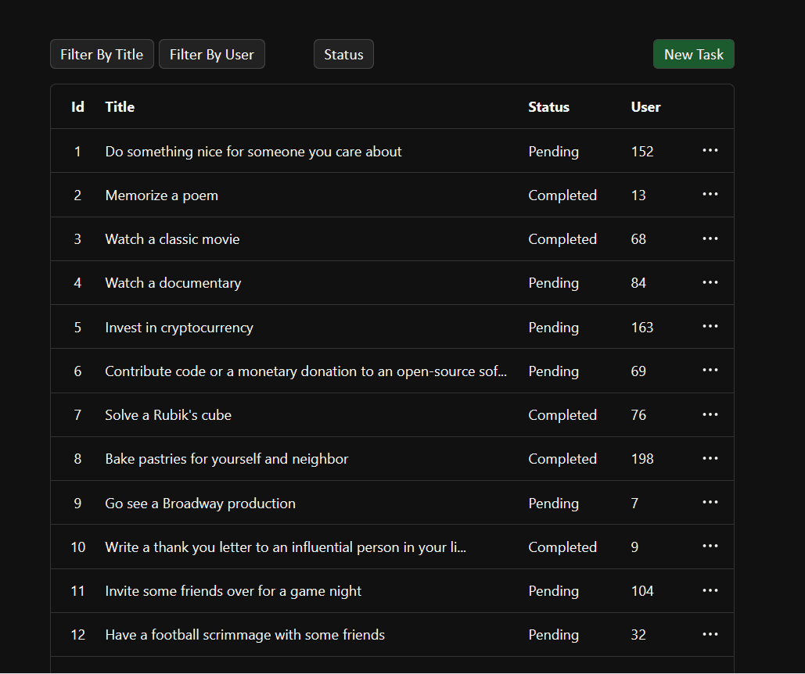

# Simple ToDo App

A minimal and clean To-Do application to practice real-world React patterns:
filters, pagination, UI state handling and a lightweight API layer.

&nbsp;
### Demo


## Features
- Add / edit / delete tasks
- Search & filter tasks
- Pagination with context state
- Clean UI with responsive layout
- User feedback with toast notifications (Sooner)

## Stack
- React + Vite
- Context API
- Custom hooks
- Styled with CSS modules
- Sooner (toast notifications)

## What I learned
- State management with Context & custom hooks
- Designing a clean component structure
- Handling server responses
- Pagination logic and user experience

## How to run

### Pre-requisites
- Node.js (v22)
- npm

### Installation
```bash
git clone https://github.com/felipe-u/simple-todo-app.git
cd simple-todo-app
npm install
```

### Run
```bash
npm run dev
```
